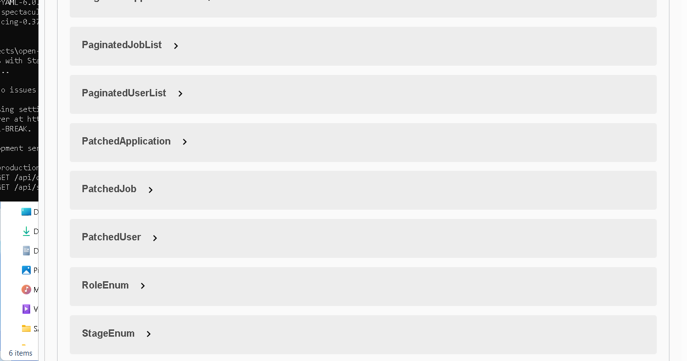

GitHub - superprogrammersys/open-recruit: Job Recruitment System · GitHub
# Job Recruitment API

**Backend API** for managing users, jobs, and applications.  
Built with **Django** and **Django REST Framework**, featuring role-based permissions, JWT authentication, pagination, and clean architecture.

---

## Features

- **User roles**: Manager, Recruiter  
- **Job management**: Create, read, update, list open/closed jobs  
- **Application management**: Track stages from new → screening → interview → offer → hired/rejected  
- **JWT authentication**: Secure token-based login with refresh  
- **Role-based permissions**: Only Managers can manage jobs/users, Recruiters can manage applications  
- **Pagination**: Cursor-based pagination for scalable APIs  
- **Clean architecture**: `queries.py`, `serializers.py`, `views.py` separation  
- **Unit & integration tests**: Ensures API stability  

---

## Tech Stack

- Python 3.x  
- Django >= 4.2  
- Django REST Framework  
- djangorestframework-simplejwt  

---

## Prerequisites

1. **Install Erlang/OTP 26.2.5**  
   Download from: [otp_win64_26.2.5.exe](https://github.com/erlang/otp/releases/tag/OTP-26.2.5)

2. **Install RabbitMQ 3.13.7**  
   Download from: [rabbitmq-server-windows-3.13.7.zip](https://github.com/rabbitmq/rabbitmq-server/releases/tag/v3.13.7)  
   Extract to a permanent location (e.g., `C:\Program Files\RabbitMQ Server\rabbitmq_server-3.13.7`)

---

## Installation

### 1. Clone repository
```bash
git clone https://github.com/superprogrammersys/open-recruit.git
cd <open-recruit
```

### 2. Create virtual environment

```bash
python -m venv venv
source venv/bin/activate      # Linux/macOS
venv\Scripts\activate         # Windows
```

### 3. Install dependencies

```bash
pip install -r requirements.txt
```

### 4. Run migrations

```bash
python manage.py migrate
```

### 5. Create superuser (optional)

```bash
python manage.py createsuperuser
```

---

## Running the Application

### 1. Start RabbitMQ (in a separate terminal)
```bash
cd "C:\Program Files\RabbitMQ Server\rabbitmq_server-3.13.7\sbin"
rabbitmq-server.bat
```
Leave this terminal open. You should see: `Starting broker... completed with 0 plugins.`

### 2. Start Celery Worker (in a separate terminal)
```bash
cd open-recruit
venv\Scripts\activate
cd source
celery -A openrecruit worker -l info -P solo
```
You should see: `celery@... ready.` and `[tasks] . api.tasks.send_email`.

### 3. Run the development server (in a separate terminal)
```bash
cd open-recruit
venv\Scripts\activate
cd source
python manage.py runserver
```

Server will start at `http://127.0.0.1:8000/`

---

## API Endpoints

### Authentication

| Method | Endpoint               | Description       |
| ------ | ---------------------- | ----------------- |
| POST   | `/auth/token/`         | Obtain JWT token  |
| POST   | `/auth/token/refresh/` | Refresh JWT token |

### Users

| Method | Endpoint       | Roles Allowed | Description     |
| ------ | -------------- | ------------- | --------------- |
| GET    | `/users/`      | Manager       | List all users  |
| POST   | `/users/`      | Manager       | Create new user |
| PATCH  | `/users/{id}/` | Manager       | Update user     |
| DELETE | `/users/{id}/` | Manager       | Delete user     |

### Jobs

| Method | Endpoint      | Roles Allowed | Description    |
| ------ | ------------- | ------------- | -------------- |
| GET    | `/jobs/`      | Manager       | List open jobs |
| POST   | `/jobs/`      | Manager       | Create new job |
| PATCH  | `/jobs/{id}/` | Manager       | Update job     |
| DELETE | `/jobs/{id}/` | Manager       | Delete job     |

### Applications

| Method | Endpoint              | Roles Allowed       | Description                           |
| ------ | --------------------- | ------------------- | ------------------------------------- |
| GET    | `/applications/`      | Recruiter / Manager | List applications (filter by `stage`) |
| POST   | `/applications/`      | Recruiter           | Create new application                |
| PATCH  | `/applications/{id}/` | Recruiter           | Update application stage or notes     |
| DELETE | `/applications/{id}/` | Recruiter           | Delete application                    |

---

## Pagination

All list endpoints use **cursor pagination**:

* `page_size = 20` by default
* Ordered by `created_at` descending

---

## Testing

Run the full test suite with:

```bash
python manage.py test
```

All tests include authentication, permissions, and CRUD operations.

---

## Project Structure

```
api/
├── models.py          # Database models (User, Job, Application)
├── serializers.py     # DRF serializers
├── queries.py         # Query helpers
├── views.py           # ViewSets with pagination & permissions
├── paginations.py     # Cursor pagination classes
├── permissions.py     # Custom role-based permissions
├── hooks.py           # Signal handlers for automatic email notifications
├── tasks.py           # Celery tasks for async email sending
tests/
├── test.py            # Unit & integration tests
```

---

## Deployment (Production)

### 1. Run RabbitMQ as a Windows Service
```bash
cd "C:\Program Files\RabbitMQ Server\rabbitmq_server-3.13.7\sbin"
rabbitmq-service.bat install
rabbitmq-service.bat start
```

### 2. Run Celery as a Windows Service (using NSSM)
Download [NSSM](https://nssm.cc/download) and run:
```bash
nssm install CeleryWorker
# Application: C:\path\to\venv\Scripts\celery.exe
# Arguments: -A openrecruit worker -l info -P solo
# Startup directory: C:\path\to\open-recruit\source
nssm start CeleryWorker
```

### 3. Run Daphne for production
```bash
daphne -b 0.0.0.0 -p 8000 openrecruit.asgi:application
```

### 4. Production Settings
Create a `settings_production.py`:
```python
from .settings import *
DEBUG = False
ALLOWED_HOSTS = ['yourdomain.com', 'your-server-ip']
SECRET_KEY = 'your-secret-key'
CELERY_BROKER_URL = 'amqp://localhost:5672//'
```

---

## Notes

* Permissions and JWT are enforced via DRF and `rest_framework_simplejwt`
* Architecture separates queries, serializers, and views for **clean code & maintainability**
* Ready to extend with caching, Celery tasks, and ASGI deployment for real-time features

## 📚 Live API Documentation


---

## License

MIT License
```